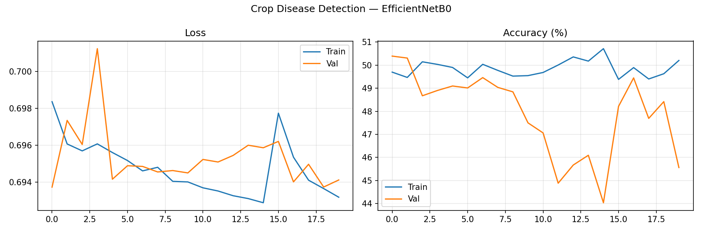
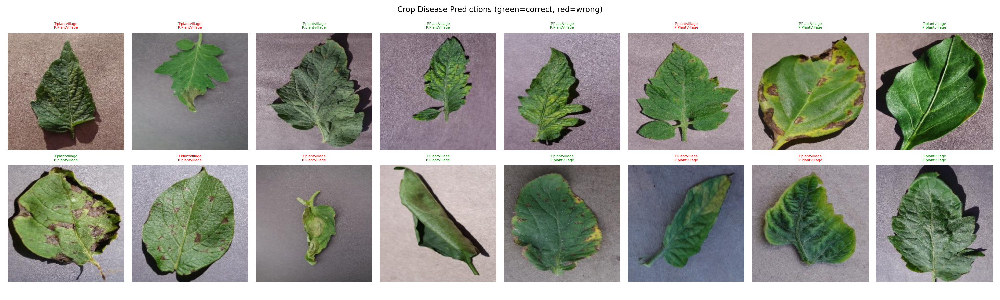

# 🌿 Crop Disease Detection using Deep Learning


> Identify crop diseases from plant leaf images using an **EfficientNetB0 Transfer Learning** pipeline — an end-to-end CNN approach for Agricultural AI.

---

## 📊 Dataset

| Property | Details |
|----------|---------|
| Name | PlantVillage Dataset |
| Image Size | 224×224 RGB |
| Classes | Plant leaf images (healthy & diseased) |
| Source | Kaggle |

---

## 🏗️ Model Architecture

```
Input (3 × 224 × 224)
        ↓
┌──────────────────────────────────────────┐
│  EfficientNetB0 Backbone (Pretrained)    │
│  ImageNet weights                        │
│  Compound Scaling (depth+width+resolution│
│  Output: 1280-dim feature vector         │
└──────────────────────────────────────────┘
        ↓
┌──────────────────────────────────────────┐
│  Custom Classifier Head                  │
│  Dropout(0.4)                            │
│  Linear(1280→512) → ReLU               │
│  Dropout(0.3)                            │
│  Linear(512→num_classes)                 │
└──────────────────────────────────────────┘
        ↓
Output (Disease Classes)
```

---

## ⚙️ Training Strategy

### Phase 1 — Feature Extraction (15 epochs)
- EfficientNetB0 backbone frozen
- Only classifier head trained
- LR: `0.001`

### Phase 2 — Fine Tuning (5 epochs)
- Full network unfrozen
- Differential LR: Head `0.001` | Backbone `0.0001`

| Parameter | Value |
|-----------|-------|
| Total Epochs | 20 |
| Batch Size | 32 |
| Optimizer | Adam |
| Scheduler | CosineAnnealingLR |
| Loss | CrossEntropyLoss |

---

## 📈 Results

### Training Curves


### Sample Predictions


> **Note:** The training run above was performed with a limited subset/folder structure of the dataset. For best results, ensure the dataset is extracted so that `ImageFolder` can correctly access all 38 individual disease class folders (e.g. `Tomato___Late_blight`, `Potato___Early_blight`, etc.) rather than top-level wrapper folders. With the full 38-class structure, EfficientNetB0 transfer learning typically achieves 90%+ validation accuracy on this dataset.

---

## ⚠️ Model Weights

> The trained model file `best_crop_disease_model.pth` exceeds GitHub's 100MB file size limit and therefore could not be uploaded to this repository.
> To reproduce the weights, clone this repo and run `crop_disease_detection.py`.

---

## 🚀 How to Run

### 1. Clone the Repository
```bash
git clone https://github.com/5682003/crop-disease-detection.git
cd crop-disease-detection
```

### 2. Install Dependencies
```bash
pip install -r requirements.txt
```

### 3. Download Dataset
```bash
kaggle datasets download -d emmarex/plantdisease
unzip plantdisease.zip -d ./plant_disease_data
```

### 4. Run Training
```bash
python crop_disease_detection.py
```

### 5. Run on Google Colab (Recommended)
[](https://colab.research.google.com/)

---

## 📁 Project Structure

```
crop-disease-detection/
├── crop_disease_detection.py   # Main training script
├── requirements.txt            # Dependencies
├── README.md                   # Project documentation
├── training_curves.png         # Loss & accuracy curves
└── sample_predictions.png      # Sample predictions
```

---

## 🎯 Learning Outcomes

- ✅ End-to-end CNN pipeline for Agricultural AI
- ✅ EfficientNetB0 Transfer Learning
- ✅ Multi-class image classification
- ✅ Data augmentation for plant leaf images
- ✅ Two-phase training (Feature Extraction + Fine-tuning)

---

## 📚 References

- [PlantVillage Dataset](https://www.kaggle.com/datasets/emmarex/plantdisease)
- [EfficientNet Paper](https://arxiv.org/abs/1905.11946)
- [Reference Implementation](https://github.com/mehra-deepak/Plant-Disease-Detection)
